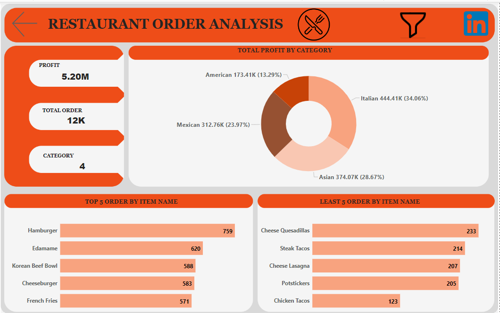

# 
 Restuarant-End-to-End Analysis

---

## Overview
A quarter's worth of orders from a fictitious restaurant serving international cuisine, including the date and time of each order, the items ordered, and additional details on the type, name and price of the items.

# 
 SQL Queries and Output

---

---

---

---

---
# 
 PowerBI Dashboard

## Data Source
This data was gotten from the Maven Analytics playground. Here is the (link) https://mavenanalytics.io/data-playground?search=restaurant. It contains 2 tables.
Menu items
Order details

## Data Cleaning
The data was predominently clean. I simply transformed the data, extracted year from the order_date column. Also extracted the month name. And,I added a conditional column named order range.

## Data Modelling

---

## Data Visualization
The visualization is a two page report. comprises of dashboard1 with a hidden filter pane, a month drillthrough and a tool tip. You can interact with the visualization (here) https://app.powerbi.com/view?r=eyJrIjoiMDQ3NDI5MmEtMjRiNy00YzE3LTg3Y2MtNDFmYzIxMzExMjg0IiwidCI6ImUyODE5OGNhLTExOWQtNDhmOC1iYzBlLTczMzIxYTM4YzJlMyJ9

## Dashboard
Dashboard           | Dashboard with filter
:------------------:|:--------------------------:
  | 
---

## Drillthrough

---

## Tooltip

---

# 
 Insights and Recommendation
## Insights

•	The Italian cuisine has the highest number of subcategories with 9 items, and it has the highest accumulated amount of 150.75, followed by the Asian dish with 8 items also but a lesser sum as compared to the Italian dish with 107.80.

•	January started off with a high number of orders, 4,156, but when February came around it saw a decline by 264. But then in March we saw an increase with total orders being 4,156(an additional 20 orders to the January figure).

•	The Italian cuisine "Shrimp Scampi" was the most expensive item on the menu, but it was not our most ordered nor did it accrue that much profit for us, instead the second most expensive item being "Korean Beef Bowl" was accrued the most amount for us, even though it was not the most ordered. "Edamame" was the most ordered because it was the cheapest item on the menu but racked in the total of 625.

•	The total number of customers that are our most loyal are 8 with total order for each person being 14, the next set of customers each made 13 total orders.

•	The total number of orders in the morning was low at 635, but it saw a spike in the afternoon with 7390 and a considerate number of orders in the evening with 4,209 total orders.

## Recommendations
•	The restaurant should investigate the decline in orders in February and ensure whatever issues that arise are fixed. And whatever implementation that was carried out in March should continue. So, the influx of customers does not decline.

•	Korean Beef Bowl soup should constantly be available as it seems that the where the restaurant is located either has a lot of Asians or the residents just love Asian cuisine.

•	Staff should be on and active from 12pm till 5pm. As it seems the number of orders at that time increases more.

---
